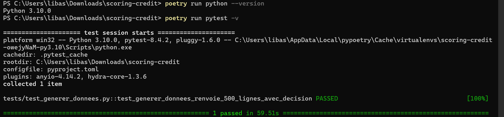
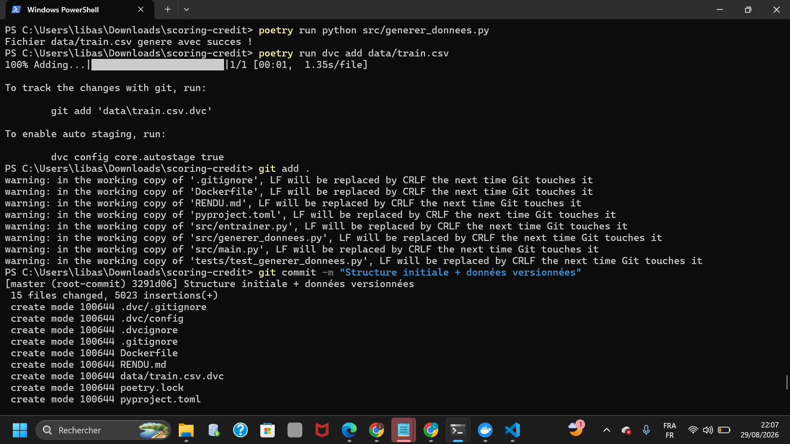
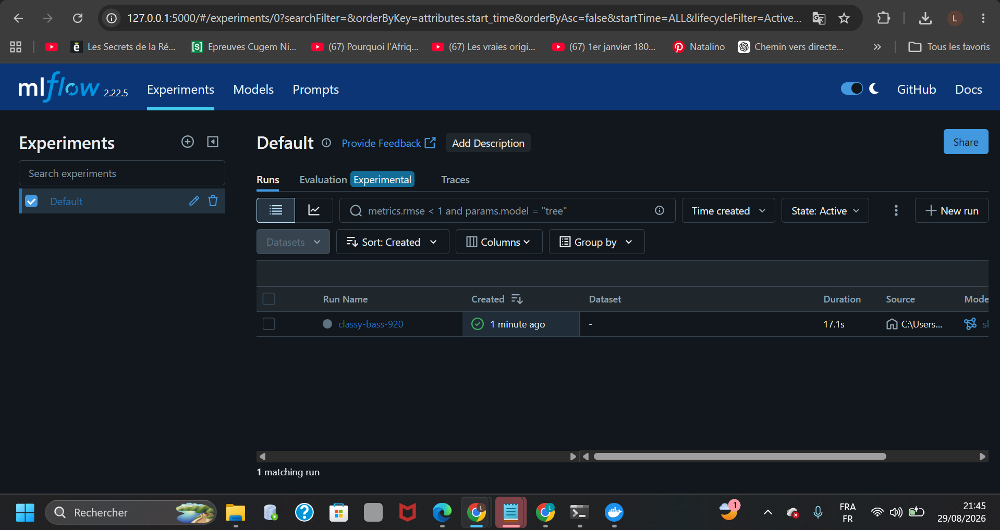
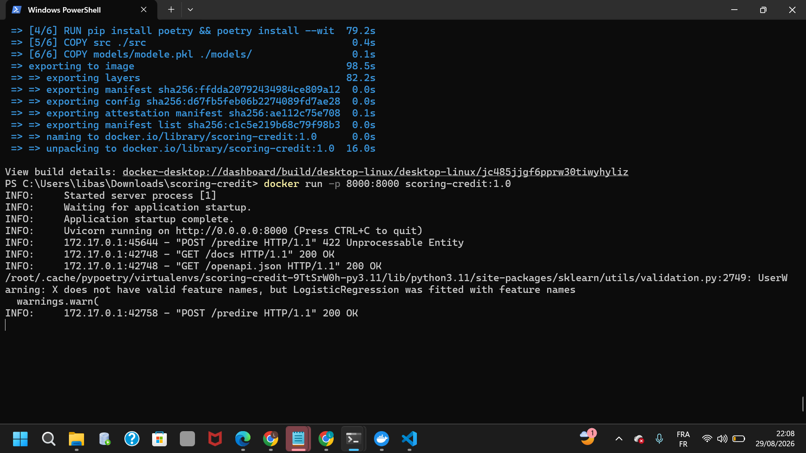
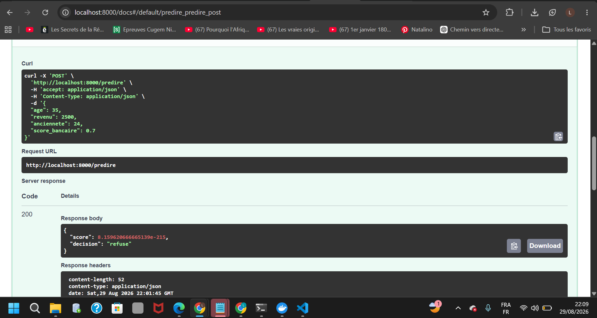

# RENDU – TP n°1 : Du prototype au modèle servi

**Module :** MLOps & Déploiement de Modèles
**Formation :** Master 1, Semestre 1 – AI & Big Data
**Établissement :** UAHB – Faculté des Sciences et Techniques, Département STIC
**Enseignant :** Nassour Abdelmahamoud
**Étudiants (binôme) :** Amadou Diallo, Libasse Gassama
**Date de rendu :** 29 / 08 / 2026

---

## Lien du dépôt

🔗 Dépôt GitHub/GitLab : `https://github.com/LibasseGassama/scoring-credit`

---

## Partie 1 – Structuration du projet (Chapitre 2)

**Livrable attendu :** Arborescence conforme + un test pytest qui passe.

- [x] Arborescence `src/`, `data/`, `tests/`, `notebooks/` créée
- [x] Projet initialisé avec Poetry (`pyproject.toml`)
- [x] Dépôt Git initialisé, premier commit effectué
- [x] Test `tests/test_generer_donnees.py` complété et passant

**Capture d'écran – résultat de `poetry run pytest -v` :**

---

## Partie 2 – Versionnement des données et suivi d'expérience (Chapitre 3)

**Livrable attendu :** Fichier `.dvc` versionné + un run MLflow visible dans l'interface.

- [x] `data/train.csv` versionné avec DVC (`data/train.csv.dvc` commité)
- [x] Script `src/entrainer.py` complété (paramètre, métrique, modèle loggés)
- [x] Run visible dans l'interface MLflow

**Capture d'écran – fichier `.dvc` et commit Git :**

**Capture d'écran – run MLflow (paramètre, métrique, modèle) :**

---

## Partie 3 – Conteneurisation du modèle (Chapitre 4)

**Livrable attendu :** Image Docker qui se construit et démarre sans erreur.

- [x] `Dockerfile` complété
- [x] Image construite avec succès (`docker build`)
- [x] Conteneur démarré sans erreur (`docker run`)

**Capture d'écran – build et run Docker :**

---

## Partie 4 – Service du modèle via une API (Chapitre 5)

**Livrable attendu :** Endpoint `/predire` fonctionnel, testé avec au moins une requête.

- [x] Schéma Pydantic `DonneesClient` complété
- [x] Route `/predire` complétée dans `src/main.py`
- [x] API lancée avec Uvicorn
- [x] Requête testée avec succès sur `/predire` (via Swagger UI)

**Capture d'écran – requête et réponse JSON de l'API :**

---

## Récapitulatif des livrables finaux

| Livrable | Statut | Preuve |
|---|---|---|
| Dépôt Git structuré, versionné, avec test qui passe | ☑ | Partie 1 |
| Données versionnées (`.dvc`) | ☑ | Partie 2 |
| Run MLflow (paramètre, métrique, modèle) | ☑ | Partie 2 |
| Image Docker fonctionnelle | ☑ | Partie 3 |
| API `/predire` testée | ☑ | Partie 4 |

---

*Dépôt public*
