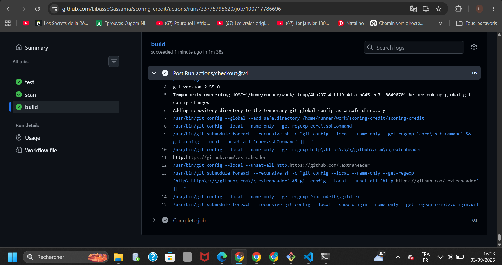
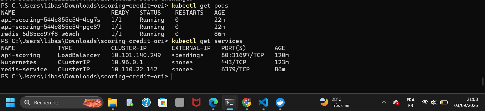
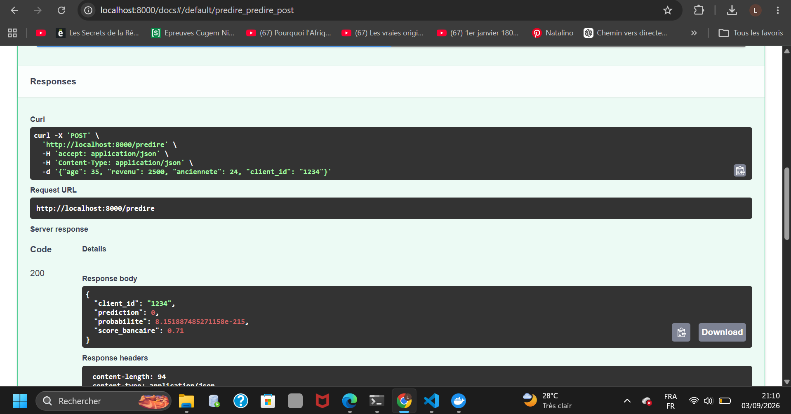
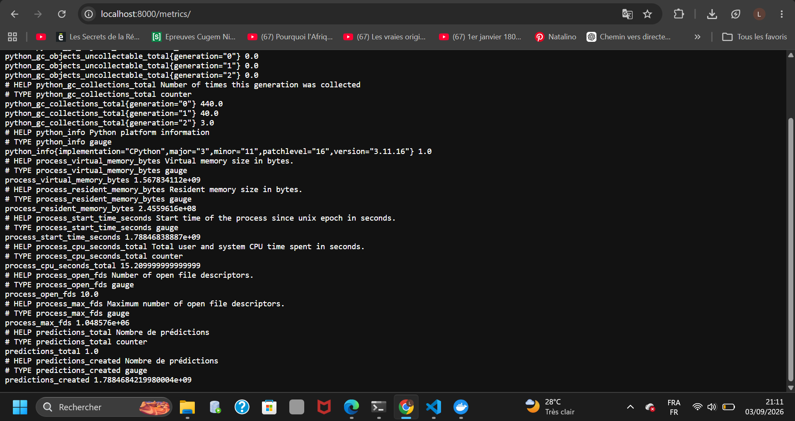
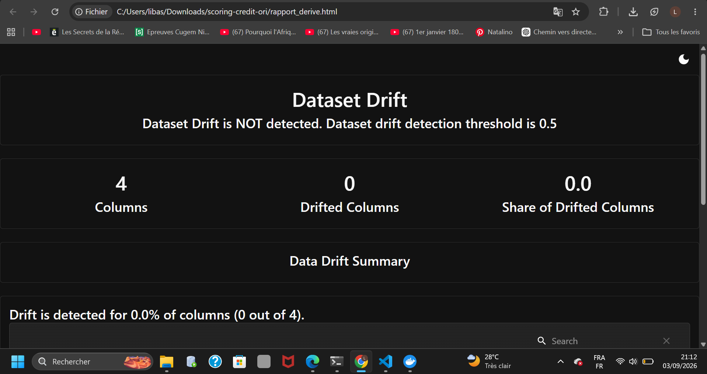
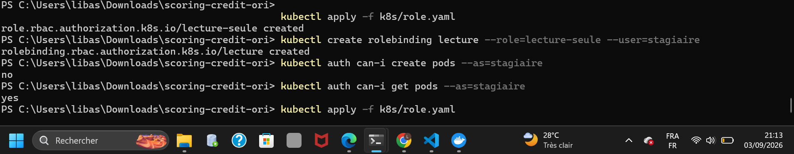

# RENDU – TP n°2 : De l'automatisation à la plateforme sécurisée

**Module :** MLOps & Déploiement de Modèles
**Formation :** Master 1, Semestre 1 – AI & Big Data
**Établissement :** UAHB – Faculté des Sciences et Techniques, Département STIC
**Enseignant :** Nassour Abdelmahamoud
**Étudiants (binôme) :** Amadou Diallo, Libasse Gassama
**Date de rendu :** 03 / 09 / 2026

---

## Lien du dépôt

🔗 `https://github.com/LibasseGassama/scoring-credit`

---

## Vue d'ensemble : pourquoi ce TP, et ce qu'on a construit

Le TP n°1 nous avait laissés avec une API FastAPI qui tourne dans un conteneur Docker sur une seule machine. C'est suffisant pour un prototype, mais pas pour une vraie mise en production : personne ne teste automatiquement le code avant de le déployer, un seul conteneur ne résiste pas à une panne, il n'y a aucune source externe de données fraîches (features), personne ne surveille si le modèle se dégrade avec le temps, et n'importe qui ayant accès au cluster pourrait tout casser.

Le TP n°2 répond à chacun de ces manques, un chapitre à la fois :

| Manque | Solution apportée | Chapitre |
|---|---|---|
| Personne ne teste avant de déployer | Pipeline CI/CD automatique | 6 |
| Un seul conteneur, pas de résilience | Déploiement Kubernetes avec plusieurs répliques | 7 |
| Les données envoyées par le client ne sont pas la seule source de vérité | Feature Store Redis | 8 |
| Personne ne sait si le modèle se dégrade | Monitoring (Prometheus) + détection de dérive (Evidently) | 9 |
| N'importe qui peut modifier le cluster | RBAC (contrôle d'accès) | 10 |

Chaque partie ci-dessous suit la même structure : **objectif → ce qu'on a fait → pourquoi → preuve (capture)**.

---

## Partie 1 – Pipeline CI/CD (Chapitre 6)

### Objectif
Automatiser trois étapes à chaque `git push` : tester le code, scanner l'image Docker à la recherche de failles de sécurité, puis construire et publier l'image.

### Ce qu'on a fait
Le TP demandait à l'origine un fichier GitLab CI (`.gitlab-ci.yml`), mais notre dépôt est sur **GitHub**, pas GitLab. On a donc utilisé l'équivalent GitHub natif : **GitHub Actions**, avec un fichier placé à `.github/workflows/ci.yml`.

Le pipeline comporte deux jobs qui s'enchaînent :

**Job `test`** :
```yaml
- name: Lancer les tests
  run: poetry run pytest -v
```
Reprend exactement la même commande que celle utilisée manuellement au TP n°1 pour vérifier que `generer_donnees()` produit bien les données attendues.

**Job `build`** (ne se lance que si `test` réussit, grâce à `needs: test`) :
1. Construit l'image Docker (`docker build`)
2. **Scanne l'image avec Trivy** à la recherche de failles `HIGH` et `CRITICAL` — si une faille grave est trouvée, `exit-code: "1"` fait échouer le job automatiquement, bloquant la mise en production d'une image vulnérable
3. Se connecte au **GitHub Container Registry** (`ghcr.io`) avec le jeton automatique `secrets.GITHUB_TOKEN` (fourni nativement par GitHub, sans configuration de mot de passe)
4. Tague et pousse l'image vers ce registre

### Pourquoi c'est important
Sans ce pipeline, chaque déploiement dépend de la discipline manuelle d'un développeur qui doit se souvenir de lancer les tests avant de pousser du code. Avec le pipeline, **c'est automatique et non contournable** : si les tests échouent ou qu'une faille critique est détectée, l'image n'est jamais publiée.

### Preuve
📸 `captures/partie1_cicd.png` — page GitHub, onglet **Actions**, montrant le pipeline exécuté avec les jobs `test` et `build` au vert.



---

## Partie 2 – Déploiement Kubernetes (Chapitre 7)

### Objectif
Déployer l'API conteneurisée sur un cluster Kubernetes local (Minikube), avec plusieurs répliques et un point d'accès réseau stable.

### Ce qu'on a fait
Deux ressources Kubernetes, définies dans `k8s/deployment.yaml` :

**Un `Deployment`** — décrit *combien* de copies (répliques) de l'API doivent tourner, et *quelle image* utiliser :
```yaml
spec:
  replicas: 2
  selector:
    matchLabels:
      app: scoring-credit
  template:
    metadata:
      labels:
        app: scoring-credit
    spec:
      containers:
        - name: api
          image: scoring-credit:1.0
          ports:
            - containerPort: 8000
```

**Un `Service`** — expose ces pods sous une seule adresse réseau stable, même si les pods redémarrent ou changent d'IP interne :
```yaml
spec:
  selector:
    app: scoring-credit
  ports:
    - port: 80
      targetPort: 8000
```

Point technique essentiel : le `label` (`app: scoring-credit`) doit être **rigoureusement identique** entre le `template` du Deployment et le `selector` du Service — c'est ce label qui permet au Service de savoir vers quels pods rediriger le trafic.

### Pourquoi c'est important
Avec 2 répliques, si un pod plante ou est redémarré, l'autre continue de répondre — c'est la base de la haute disponibilité. Le Service donne une adresse stable (`api-scoring`) que les autres composants du cluster (comme Redis, voir Partie 3) peuvent appeler sans se soucier de quel pod répond exactement.

### Preuve
📸 `captures/partie2_k8s.png` — résultat de `kubectl get pods` (montrant les pods à l'état `Running`) et `kubectl get services`.



```
NAME                           READY   STATUS    RESTARTS   AGE
api-scoring-585dc86f65-sqxd7   1/1     Running   0          ...
api-scoring-585dc86f65-vr5t9   1/1     Running   0          ...
redis-5d85cc97f8-w6wch         1/1     Running   0          ...
```

---

## Partie 3 – Feature Store Redis (Chapitre 8)

### Objectif
Stocker une "feature" (une variable utilisée par le modèle) dans Redis, et faire en sorte que l'API la lise depuis Redis au moment de la prédiction, plutôt que de la recevoir directement dans la requête du client.

### Ce qu'on a fait

**Écriture de la feature** (`src/ecrire_feature.py`), exécuté une fois pour simuler une feature déjà collectée :
```python
import redis
r = redis.Redis(host="localhost", port=6379)
r.set("client:1234:score_bancaire", 0.71)
```

**Lecture dans l'API** (`src/main.py`) : le schéma `DonneesClient` ne contient plus `score_bancaire` — la variable a été remplacée par `client_id`. L'API va chercher cette valeur elle-même dans Redis :
```python
r = redis.Redis(host="redis-service", port=6379, decode_responses=True)

@app.post("/predire")
def predire(donnees: DonneesClient):
    compteur.inc()
    score_bancaire = r.get(f"client:{donnees.client_id}:score_bancaire")
    if score_bancaire is None:
        score_bancaire = 0.5  # valeur de repli si la feature n'existe pas
    else:
        score_bancaire = float(score_bancaire)
    ...
```

**Point technique clé** : à l'intérieur du cluster, on ne se connecte pas à Redis via `localhost` (qui ne désignerait que le pod de l'API lui-même), mais via le **nom du Service Kubernetes** `redis-service` — Kubernetes fournit une résolution DNS interne automatique entre tous les pods d'un même cluster.

### Pourquoi c'est important
En production réelle, un client qui demande un score de crédit n'envoie généralement pas lui-même toutes les données utilisées par le modèle (par exemple son historique bancaire complet) — ces données sont déjà stockées côté entreprise. Un Feature Store centralise ces variables pré-calculées et les rend disponibles à faible latence au moment de la prédiction, sans dépendre de ce que le client fournit.

### Preuve
📸 `captures/partie3_redis.png` — requête `/predire` avec seulement `age`, `revenu`, `anciennete`, `client_id` envoyés, et `score_bancaire: 0.71` dans la réponse, prouvant que la valeur vient bien de Redis et non de la requête.



```json
Requête envoyée :
{"age": 35, "revenu": 2500, "anciennete": 24, "client_id": "1234"}

Réponse obtenue :
{
  "client_id": "1234",
  "prediction": 0,
  "probabilite": 8.15e-215,
  "score_bancaire": 0.71
}
```

---

## Partie 4 – Monitoring et détection de dérive (Chapitre 9)

### Objectif
Exposer des métriques techniques consultables par un outil de supervision (Prometheus), et générer un rapport qui détecte si les données reçues récemment "dérivent" statistiquement par rapport aux données d'entraînement.

### Ce qu'on a fait

**Métriques Prometheus** (`src/main.py`) :
```python
from prometheus_client import Counter, make_asgi_app

app.mount("/metrics", make_asgi_app())
compteur = Counter("predictions_total", "Nombre de prédictions")

@app.post("/predire")
def predire(donnees: DonneesClient):
    compteur.inc()
    ...
```
`make_asgi_app()` crée une mini-application qui expose automatiquement toutes les métriques au format Prometheus sur la route `/metrics`. `Counter` est un type de métrique qui ne fait qu'augmenter — parfait pour compter un nombre d'événements (ici, chaque appel à `/predire`).

**Détection de dérive avec Evidently** (`detecter_derive.py`) :
```python
import pandas as pd
from evidently.report import Report
from evidently.metric_preset import DataDriftPreset

reference = pd.read_csv("data/train.csv").drop(columns=["decision"])
current = pd.read_csv("data/train.csv").drop(columns=["decision"])

rapport = Report(metrics=[DataDriftPreset()])
rapport.run(reference_data=reference, current_data=current)
rapport.save_html("rapport_derive.html")
```
`DataDriftPreset` compare statistiquement (test de Kolmogorov-Smirnov pour les variables numériques) la distribution de chaque variable entre les données de référence (l'entraînement) et les données courantes (récentes).

**Résultat obtenu** : comme `reference` et `current` utilisent volontairement le même fichier dans ce TP (faute de vraies nouvelles données collectées en production), le rapport indique logiquement "Dataset Drift is NOT detected" sur les 4 colonnes — c'est le comportement normal attendu.

### Pourquoi c'est important
Un modèle de ML entraîné sur des données d'il y a six mois peut devenir moins pertinent si le profil des clients change (par exemple une crise économique qui modifie la distribution des revenus). Sans surveillance, personne ne le remarque jusqu'à ce que les décisions deviennent visiblement mauvaises. Prometheus donne une vue en temps réel de l'usage (combien de prédictions, quand), tandis qu'Evidently donne une vue statistique de la santé des données en amont du modèle.

### Preuve

📸 `captures/partie4_metrics.png` — page `/metrics` montrant `predictions_total 1.0` (ou plus), preuve que le compteur s'incrémente à chaque appel.



📸 `captures/partie4_evidently.png` — rapport HTML Evidently, section "Dataset Drift Summary".



```
Dataset Drift is NOT detected. Dataset drift detection threshold is 0.5
Drift is detected for 0.0% of columns (0 out of 4).
age, anciennete, revenu, score_bancaire : Not Detected (K-S p_value = 1)
```

---

## Partie 5 – Sécuriser l'accès au cluster avec RBAC (Chapitre 10)

### Objectif
Créer un compte restreint qui peut uniquement **consulter** les ressources du cluster (pods, services), sans jamais pouvoir les créer, modifier ou supprimer.

### Ce qu'on a fait

**Un `Role`** (`k8s/role.yaml`) définissant les permissions autorisées :
```yaml
kind: Role
metadata:
  namespace: default
  name: lecture-seule
rules:
  - apiGroups: [""]
    resources: ["pods", "services"]
    verbs: ["get", "list"]
```
Les verbes `get` (consulter une ressource précise) et `list` (lister toutes les ressources d'un type) correspondent uniquement à de la lecture — aucun verbe d'écriture (`create`, `update`, `delete`) n'est inclus.

**Un `RoleBinding`**, qui associe ce rôle à un utilisateur fictif nommé `stagiaire` :
```powershell
kubectl create rolebinding lecture --role=lecture-seule --user=stagiaire
```

### Vérification (la preuve que ça fonctionne vraiment)
```powershell
kubectl auth can-i create pods --as=stagiaire
# → no

kubectl auth can-i get pods --as=stagiaire
# → yes
```
Le contraste entre les deux réponses prouve que la restriction est bien appliquée : `stagiaire` peut consulter les pods, mais ne peut absolument pas en créer.

### Pourquoi c'est important
En entreprise, tout le monde n'a pas besoin des mêmes droits sur un cluster de production. Un stagiaire ou un membre d'une équipe de support n'a besoin que de consulter l'état des services pour diagnostiquer un problème — lui donner accidentellement le droit de tout modifier est un risque de sécurité majeur (suppression accidentelle d'un déploiement, modification d'une configuration critique, etc.). RBAC applique le principe du moindre privilège.

### Preuve
📸 `captures/partie5_rbac.png` — terminal montrant les deux commandes `kubectl auth can-i` et leurs réponses contrastées (`no` puis `yes`).



---

## Difficultés rencontrées et comment on les a résolues

Cette section est volontairement détaillée : elle montre qu'on a compris le fonctionnement interne des outils, pas seulement recopié des commandes.

### 1. Incompatibilité de version scikit-learn entre l'entraînement et l'image Docker
**Symptôme** : l'API renvoyait une erreur 500, avec dans les logs `InconsistentVersionWarning: Trying to unpickle estimator ... from version 1.3.2 when using version 1.7.2`, suivie d'un crash `AttributeError: 'DecisionTreeClassifier' object has no attribute 'monotonic_cst'`.

**Cause** : le fichier `models/modele.pkl` avait été sauvegardé avec une ancienne version de scikit-learn (1.3.2), tandis que l'environnement du conteneur Docker utilisait une version plus récente (1.7.2) dont le format interne des objets a changé.

**Solution** : réentraîner le modèle directement avec l'environnement Poetry du projet (`poetry run python -m src.entrainer`), garantissant que la version de scikit-learn utilisée pour sauvegarder le modèle est identique à celle installée dans l'image Docker.

### 2. Minikube gardait une ancienne version de l'image en cache
**Symptôme** : même après avoir corrigé le modèle et refait `docker build` + `minikube image load`, le warning de version persistait à l'identique dans les logs du pod.

**Cause** : `minikube image load` peut échouer silencieusement à remplacer une image déjà présente sous le même tag (`scoring-credit:1.0`) dans le nœud Minikube — l'ancienne version restait donc utilisée par les pods.

**Solution** : supprimer explicitement l'ancienne image du nœud avant de recharger la nouvelle :
```powershell
minikube ssh -- sudo crictl rmi <nom-image>
minikube image load scoring-credit:1.0
kubectl rollout restart deployment api-scoring
```

### 3. Incompatibilité de version de la bibliothèque Evidently
**Symptôme** : `ModuleNotFoundError: No module named 'evidently.report'` après avoir installé Evidently avec `poetry add evidently`.

**Cause** : Poetry avait installé la toute dernière version (0.7.21), dans laquelle l'API interne a été restructurée — le module `evidently.report` de l'énoncé du TP correspond à l'ancienne API (versions 0.4.x).

**Solution** : fixer explicitement une version compatible avec la syntaxe attendue :
```powershell
poetry remove evidently
poetry add "evidently<0.5"
```

### 4. Connexion Redis en dur sur `localhost`
**Symptôme** : une fois l'API déployée dans le cluster, elle ne parvenait pas à lire la feature Redis.

**Cause** : le code pointait vers `localhost`, valide uniquement en test local (où l'API et Redis tournent sur la même machine), mais invalide dans le cluster où l'API et Redis sont deux pods séparés.

**Solution** : utiliser le nom du Service Kubernetes de Redis (`redis-service`) comme hôte, en s'appuyant sur la résolution DNS interne automatique de Kubernetes entre pods d'un même cluster.

---

## Récapitulatif des livrables finaux

| Livrable | Statut | Preuve |
|---|---|---|
| Pipeline CI/CD (test, scan, build) au vert | ☑ | Partie 1 |
| Déploiement Kubernetes (pod `Running`, API accessible via le Service) | ☑ | Partie 2 |
| Feature Store Redis (feature écrite et relue par l'API) | ☑ | Partie 3 |
| Monitoring (`/metrics` actif, rapport de dérive généré) | ☑ | Partie 4 |
| Accès sécurisé (RBAC appliqué et vérifié) | ☑ | Partie 5 |

---

## Pour reproduire ou présenter en live

Toutes les commandes détaillées, dans l'ordre exact d'exécution, sont disponibles dans `COMMANDES_TP2.md` à la racine du dépôt.

---

*Dépôt public *
